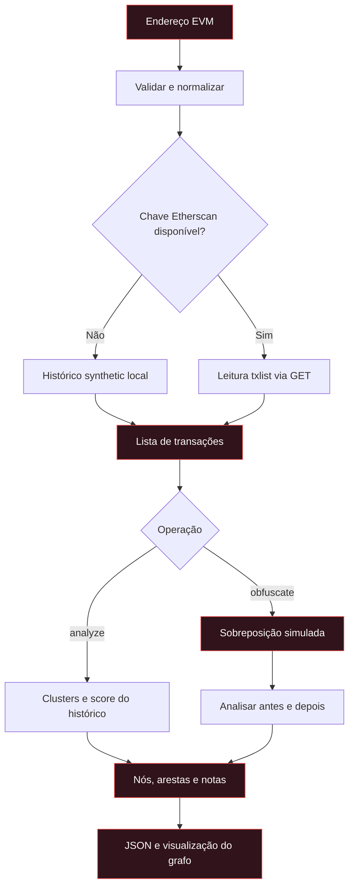
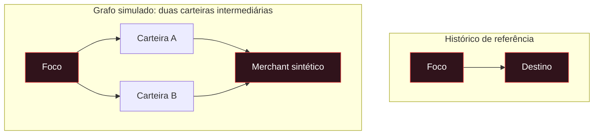
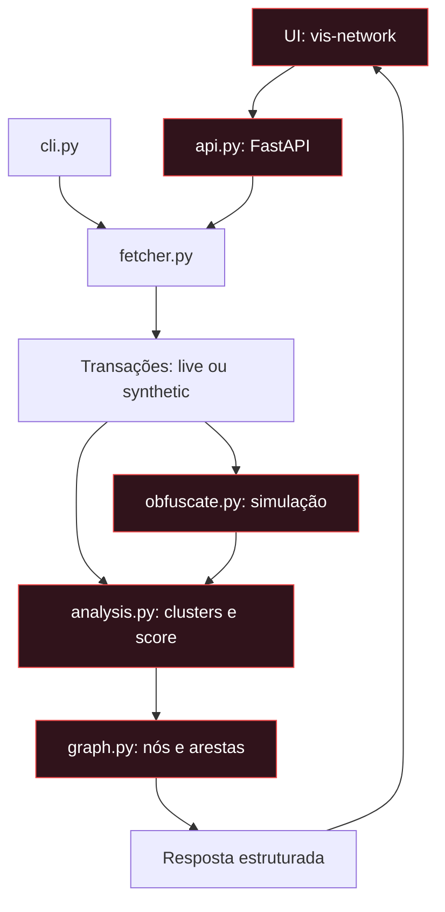

# ◆ VeilGraph

```
██╗   ██╗███████╗██╗██╗     ██████╗ ██████╗  █████╗ ██████╗ ██╗  ██╗
██║   ██║██╔════╝██║██║     ██╔════╝ ██╔══██╗██╔══██╗██╔══██╗██║  ██║
██║   ██║█████╗  ██║██║     ██║  ███╗██████╔╝███████║██████╔╝███████║
╚██╗ ██╔╝██╔══╝  ██║██║     ██║   ██║██╔══██╗██╔══██║██╔═══╝ ██╔══██║
 ╚████╔╝ ███████╗██║███████╗╚██████╔╝██║  ██║██║  ██║██║     ██║  ██║
  ╚═══╝  ╚══════╝╚═╝╚══════╝ ╚═════╝ ╚═╝  ╚═╝╚═╝  ╚═╝╚═╝     ╚═╝  ╚═╝

  on-chain graph analyzer · privacy/obfuscation simulator
  ⚠  read-only — nenhuma transação é criada ou enviada
```

> **on-chain graph analyzer · privacy/obfuscation simulator (EVM, read-only)**


VeilGraph é uma ferramenta **educacional/defensiva** que analisa a
rastreabilidade de carteiras na Ethereum (EVM) e simula estratégias de
ofuscação de privacidade sobre o grafo de transações real — tudo **sem nunca
criar ou transmitir uma transação**.

O objetivo é duplo e espelhado (*dual-view*):

1. **Trace** — mostrar como ferramentas de *chain surveillance* reconstroem o
   grafo de propriedade de uma carteira a partir de heurísticas públicas.
2. **Hide** — simular técnicas de ofuscação (split-payment, fan-out, peeling)
   e **medir** o quanto cada uma realmente reduz a rastreabilidade — e onde
   ela **vaza**.

> ⚠️ Nenhuma transação é enviada. O módulo de ofuscação é um simulador sobre o
> grafo. É pesquisa/defesa, não uma ferramenta de evasão operacional.

---

## Por quê?

Carteiras "desvinculadas" muitas vezes são reconectadas por análise de grafo.
Quem audita contratos, rastreia fundos ou faz due-diligence precisa entender
**como** essas técnicas funcionam e **como são derrotadas**. VeilGraph torna
esse conhecimento visual e quantitativo.

---


## Visão do processamento



Fluxo nominal: falhas do serviço live podem retornar erro; não presuma fallback
offline para qualquer falha. As arestas simuladas existem apenas em memória:
não há assinatura nem transmissão para a blockchain.

### Como interpretar o score

O cálculo usa a menor distância até um **sink** (nó que só recebe) e acrescenta
20 pontos quando o foco pertence a um cluster inferido, limitado a 100.

| Distância até o sink | Score-base, sem penalidade de cluster |
|---|---:|
| 1 aresta | 100 |
| 2 arestas | 65 |
| 3 arestas | 30 |
| 4 ou mais arestas | 0 |

Esta tabela descreve caminhos alcançáveis a partir de um foco com saídas.
Casos sem transações, sem caminho ou com o próprio foco como sink recebem
tratamento específico em `analysis.py`.

> **Score não é probabilidade de identificação.** Zero não comprova anonimato;
> clusters são inferências, não prova de propriedade. O resultado depende dos
> dados disponíveis e das heurísticas implementadas.

### Exemplo visual: pagamento direto e modelo split



Esquema conceitual, não captura de uma execução. No modelo `split_payment`,
o financiamento das intermediárias **continua no grafo**; desaparece apenas
a aresta direta. A simulação redireciona os pagamentos para um sink sintético
compartilhado, portanto não reproduz integralmente a economia de uma carteira real.

## O que ele faz

### `POST /analyze` — análise de grafo
Busca o histórico de um endereço (Etherscan, read-only) e aplica heurísticas
clássicas de *surveillance on-chain*:

| Heurística | O que detecta |
|---|---|
| **Common-input / fan-in** | Carteiras que financiam a mesma carteira com valores que somam um pagamento posterior são ligadas como mesmo dono. |
| **Round-trip / change** | Fluxos `A→B` e `B→A` indicam mesmo dono (endereço de troco). |
| **Score de rastreabilidade** | `0` = menor score do modelo · `100` = maior score do modelo. Baseado na distância de grafo (BFS) do foco até o *sink* (exchange/deposit/merchant) + penalidade de cluster. |

### `POST /obfuscate` — simulador de ofuscação
Sobrepõe um modelo de privacidade ao grafo real e devolve o novo score:

| Estratégia | O que faz | Efeito no score | Onde vaza |
|---|---|---|---|
| `split_payment` | N carteiras-irmãs enviam frações ao merchant; a carteira foco some da aresta direta. | reduz (ex: 100→65) | correlação de valor (soma == pagamento) |
| `fan_out` | a foco espalha fundos em N carteiras; uma paga. | mantém (foco ainda financia as irmãs) | round-trip imediato foco↔irmã |
| `peeling` | cadeia de hops 1-entrada/1-saída encaminha o valor. | pode zerar | valores iguais expõem a cadeia (heurística de peeling) |

---

## Stack

- **Python 3.11+** · FastAPI · networkx · httpx · pydantic
- **UI**: HTML/JS estático com [vis-network](https://visjs.github.io/vis-network/)
- Sem banco de dados · sem dependência de rede para o modo *synthetic*
- Testes com pytest (100% offline, sem chamadas de rede)

---

## Uso local

```bash
# 1. clone / entre na pasta
cd veilgraph
python -m venv .venv && source .venv/bin/activate
pip install -e ".[dev]"

# 2. (opcional) dados reais da Ethereum
export VEILGRAPH_ETHERSCAN_API_KEY=sua_key_gratuita

# 3. rode a API + UI
uvicorn veilgraph.api:app --host 0.0.0.0 --port 8000
# abra http://localhost:8000
```

Sem a API key, o modo cai automaticamente para **synthetic** (histórico fake
determinístico, 100% offline) — ótimo pra demo e CI.

### Notas de segurança

- **A chave de API nunca aparece em exceções.** A URL do Etherscan contém a
  chave como parâmetro de query; por isso os erros HTTP são relançados sem a
  URL, apenas com o tipo da falha e a mensagem da API (há teste que garante
  isso: `test_erro_http_nao_vazao_url_com_api_key`).
- **Endereços são validados** (`0x` + 40 hex). Entradas como `0xzz` eram
  aceitas antes e geravam chamadas inúteis ou grafos sintéticos enganosos.
- Nada aqui assina ou transmite transação. A ferramenta é **read-only** por
  construção: o único verbo HTTP usado é `GET` contra a API do Etherscan.

### CLI

```bash
veilgraph analyze 0x1234... --api-key SUAKEY
veilgraph obfuscate 0x1234... --strategy split_payment --fan-out 3
```

---

## Exemplo de resposta da API

`POST /analyze`

```json
{
  "focus": "0x1111...1111",
  "mode": "synthetic",
  "traceability_score": 100.0,
  "clusters": [],
  "nodes": [{ "id": "0x1111...1111", "is_focus": true, "inferred_owner": null }],
  "edges": [{ "source": "0x1111...1111", "target": "0xmerchant...dead", "value_eth": 1.23, "kind": "flow" }],
  "notes": ["Nenhuma heurística de co-propriedade disparou..."]
}
```

`POST /obfuscate` (estratégia `split_payment`, fan-out 3)

```json
{
  "focus": "0x1111...1111",
  "before_score": 100.0,
  "after_score": 65.0,
  "notes": [
    "split_payment: carteiras-irmãs enviam frações do pagamento...",
    "Heurística de fan-in/round-trip ligou ..."
  ]
}
```

---

## Arquitetura



Visão das responsabilidades compartilhadas; a API e a CLI orquestram as chamadas.
A UI só é servida quando o diretório estático esperado pela API está disponível.


| Módulo | Responsabilidade |
|---|---|
| `fetcher.py` | Leitura (live Etherscan, read-only) + gerador *synthetic* determinístico. |
| `analysis.py` | Heurísticas de clusterização (fan-in, round-trip) e score de rastreabilidade (BFS). |
| `obfuscate.py` | Simulador das estratégias de privacidade sobre o grafo real. |
| `graph.py` | Montagem de `nodes`/`edges` (com `inferred_owner`) para a UI. |
| `api.py` | Endpoints FastAPI + serviço da UI estática. |
| `cli.py` | Interface de linha de comando (`analyze`, `obfuscate`). |
| `static/index.html` | UI: grafo navegável + veredito + clusters. |
| `tests/` | Testes (sem rede). |

---

## Testes

```bash
pytest -v --cov=veilgraph --cov-report=term-missing
```

Cobre: determinismo do gerador *synthetic*, heurísticas de fan-in e round-trip,
faixas do score, e os três cenários de ofuscação (incluindo a asserção de que
`split_payment` reduz o score e esconde a aresta direta de pagamento).

---

## Deploy (Docker / Render / Railway)

```bash
docker build -t veilgraph .
docker run -p 8000:8000 -e VEILGRAPH_ETHERSCAN_API_KEY=... veilgraph
```

No Render/Railway: aponte o build para este repo, `Dockerfile` já existe, e o
start command é `uvicorn veilgraph.api:app --host 0.0.0.0 --port $PORT`.
Para dados reais, defina a var `VEILGRAPH_ETHERSCAN_API_KEY` no painel.

---

## Limitações / escopo

- **Read-only**: não assina, não envia, não interage com carteiras.
- O modo *live* depende do `txlist` do Etherscan (histórico normal); não faz
  join com transfers de tokens ERC-20 internos por padrão.
- As heurísticas são modelos didáticos das técnicas reais de surveillance, não
  um substituto para ferramentas comerciais (Elliptic, Chainalysis, etc).

---

## Licença

MIT — use, estenda e cite.
